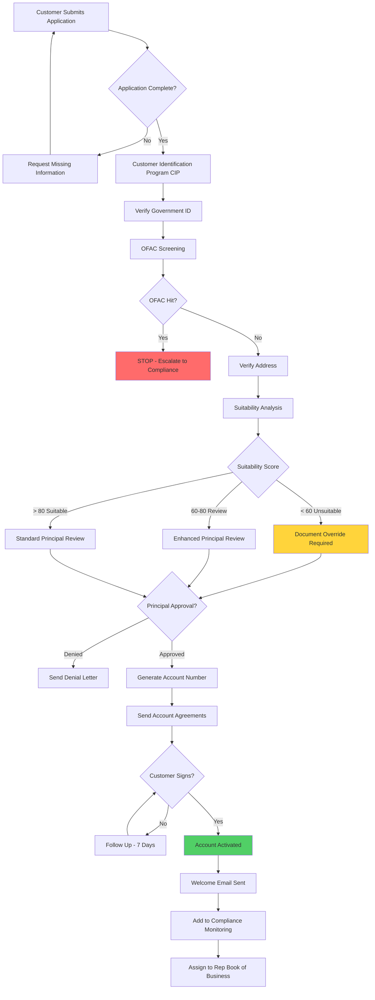
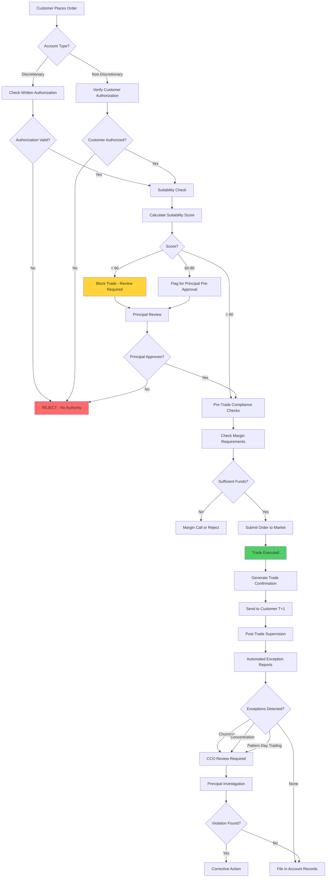
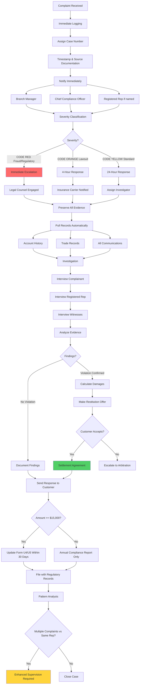
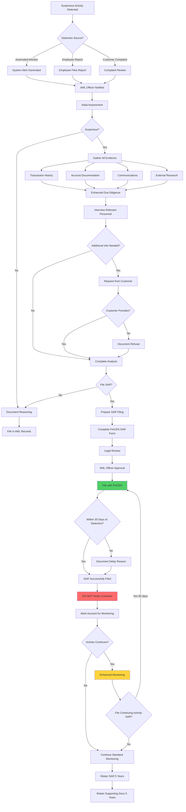
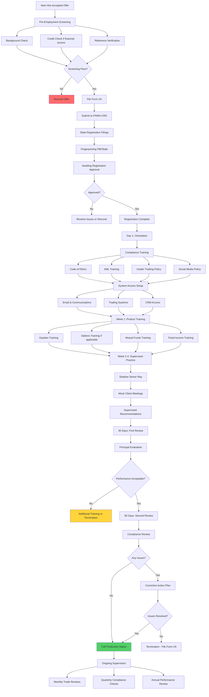
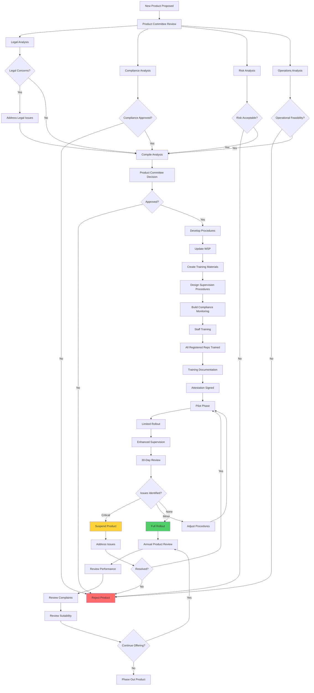
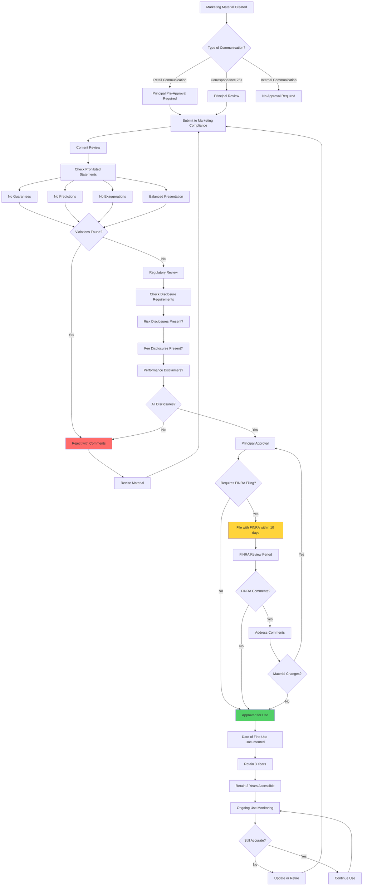
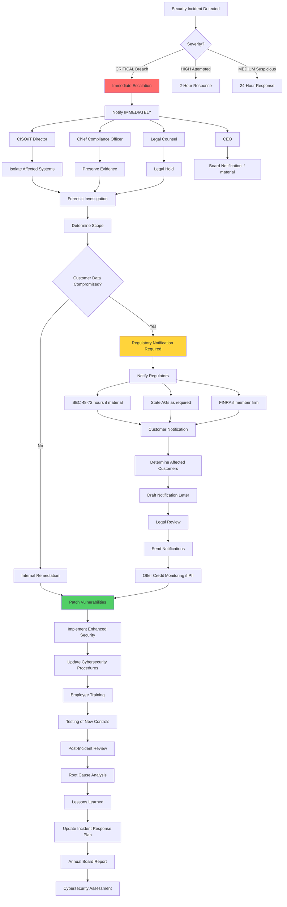

# Visual Workflow Diagrams

## 📊 COMPREHENSIVE PROCESS FLOWS

### Purpose
Visual representations of all critical compliance workflows. These diagrams use Mermaid syntax and render automatically in GitHub, VS Code, and most markdown viewers.

---

## 1. NEW ACCOUNT OPENING WORKFLOW

**Key Timeframes:**
- Principal Approval: Within 30 days of account opening (FINRA Rule 4512)
- OFAC Screening: Before first transaction
- Customer Agreements: Before first trade

---

## 2. TRADE APPROVAL AND SUPERVISION WORKFLOW

**Key Regulations:**
- FINRA Rule 2111 (Suitability)
- FINRA Rule 3110 (Supervision)
- Regulation T (Margin Requirements)

---

## 3. CUSTOMER COMPLAINT HANDLING WORKFLOW

**Required Actions:**
- Acknowledge receipt: 2 business days
- Complete investigation: 10 business days (standard)
- Form U4/U5 update: 30 days if $15,000+
- Retention: 4 years minimum

---

## 4. REGULATORY EXAMINATION RESPONSE WORKFLOW

```mermaid
flowchart TD
    A[Examination Notice Received] --> B[HOUR 1: Emergency Response]
    
    B --> C[Notify Immediately]
    C --> D[Chief Compliance Officer]
    C --> E[Chief Executive Officer]
    C --> F[Legal Counsel]
    C --> G[All Principals]
    
    D --> H[Preserve All Documents]
    E --> H
    F --> H
    G --> H
    
    H --> I[STOP Document Destruction]
    I --> J[Suspend Document Retention]
    J --> K[Preserve Electronic Communications]
    K --> L[Back Up All Systems]
    
    L --> M[Create Examination Team]
    M --> N[Examination Coordinator CCO]
    M --> O[Document Custodian]
    M --> P[Legal Liaison]
    M --> Q[IT Coordinator]
    
    N --> R[DAY 1: Initial Preparation]
    O --> R
    P --> R
    Q --> R
    
    R --> S[Analyze Examination Request]
    S --> T[Document All Requested Items]
    T --> U[Create Production Checklist]
    U --> V[Identify Potential Issues]
    
    V --> W[Assemble Response Team]
    W --> X[Begin Document Collection]
    X --> Y[Personnel Briefing]
    Y --> Z[Legal Strategy Session]
    
    Z --> AA[WEEK 1: Examination Preparation]
    AA --> AB[Organize Requested Materials]
    AB --> AC[Create Comprehensive Index]
    AC --> AD[Label Clearly]
    AD --> AE[Privilege Review]
    
    AE --> AF[Practice Interviews]
    AF --> AG[Mock Interviews for Key Personnel]
    AG --> AH[Testimony Coaching]
    
    AH --> AI[Issue Identification]
    AI --> AJ[Conduct Internal Investigation]
    AJ --> AK[Identify Weaknesses Proactively]
    AK --> AL[Prepare Explanations]
    AL --> AM[Develop Remediation Plans]
    
    AM --> AN[Provide Documents to Examiners]
    AN --> AO[Examination Fieldwork]
    
    AO --> AP[Daily Status Meetings]
    AP --> AQ[Track Progress]
    AQ --> AR[Monitor Examination Progress]
    AR --> AS[Adjust Strategy as Needed]
    
    AS --> AT[Examination Complete]
    AT --> AU{Deficiencies Found?}
    AU -->|Yes| AV[Deficiency Letter Received]
    AU -->|No| AW[Exit Interview]
    
    AV --> AX[Response Due 30 Days]
    AX --> AY[Prepare Detailed Response]
    AY --> AZ[Implement Remediation]
    AZ --> BA[Submit Response]
    
    BA --> BB{Accepted?}
    BB -->|No| BC[Additional Response Required]
    BB -->|Yes| BD[Close Examination]
    
    BC --> AX
    
    AW --> BD
    BD --> BE[Post-Examination Review]
    BE --> BF[Document Lessons Learned]
    BF --> BG[Update Procedures]
    BG --> BH[Additional Training]
    
    style A fill:#ff6b6b
    style BD fill:#51cf66
    style AV fill:#ffd43b
```

**Critical Timeframes:**
- Hour 1: Emergency notifications and document preservation
- Day 1: Initial preparation and team assembly
- Week 1: Document production and practice interviews
- 30 Days: Deficiency response deadline (if applicable)

---

## 5. AML SUSPICIOUS ACTIVITY REPORTING (SAR) WORKFLOW

**Critical Requirements:**
- File within 30 days of initial detection
- Do NOT notify customer (federal crime to tip off)
- Retain SAR and supporting documents for 5 years
- Continuing activity SARs every 90 days if ongoing
- Absolute confidentiality

---

## 6. ANNUAL COMPLIANCE REVIEW CYCLE

```mermaid
flowchart TD
    A[January: Planning] --> B[Review Prior Year]
    B --> C[Identify Regulatory Changes]
    C --> D[Set Annual Compliance Goals]
    
    D --> E[February: Documentation Prep]
    E --> F[Gather All Required Documents]
    F --> G[Organize by Category]
    
    G --> H[March: Mock Audit]
    H --> I[External Consultant Engaged]
    I --> J[Audit Fieldwork Week 1-2]
    J --> K[Sample Account Review]
    K --> L[Trade Supervision Review]
    L --> M[WSP Review]
    
    M --> N[April: Audit Report]
    N --> O[Findings Documented]
    O --> P[Severity Classification]
    P --> Q[Management Responses]
    
    Q --> R[May: Remediation Plans]
    R --> S[Assign Responsible Parties]
    S --> T[Set Completion Deadlines]
    
    T --> U[June-August: Implementation]
    U --> V[Critical Findings First]
    V --> W[High Findings Next]
    W --> X[Medium/Low Findings]
    
    X --> Y[September: Verification]
    Y --> Z[CCO Verifies Critical/High]
    Z --> AA[Supervisor Verifies Medium]
    AA --> AB[Self-Certification Low]
    
    AB --> AC[October: Follow-Up Testing]
    AC --> AD[Test Remediation Effectiveness]
    AD --> AE{All Findings Resolved?}
    AE -->|No| AF[Extended Remediation]
    AE -->|Yes| AG[November: Annual Report Prep]
    
    AF --> AG
    
    AG --> AH[Draft Annual Compliance Report]
    AH --> AI[CEO Review]
    AI --> AJ[Legal Review]
    AJ --> AK[Board Review]
    
    AK --> AL[December: Board Presentation]
    AL --> AM[Present to Board]
    AM --> AN[Board Approval]
    AN --> AO[File with Records]
    
    AO --> AP[Next Year Planning]
    AP --> A
    
    style H fill:#ffd43b
    style AN fill:#51cf66
    style AF fill:#ff6b6b
```

**Key Deliverables:**
- Q1: Mock audit completion
- Q2: Remediation plans finalized
- Q3: Implementation of fixes
- Q4: Annual compliance report to board

---

## 7. EMPLOYEE ONBOARDING AND LICENSING WORKFLOW

**Registration Timeline:**
- Form U4 filing: Before first day
- FINRA approval: Typically 2-4 weeks
- State registrations: Varies by state
- Initial training: First 2 weeks
- Full production: After 90-day probation

---

## 8. PRODUCT APPROVAL AND REVIEW WORKFLOW

**Required Steps:**
- Product committee approval before offering
- Written supervisory procedures updated
- All reps trained with documentation
- Pilot phase with enhanced supervision
- Annual product review

---

## 9. ADVERTISING AND MARKETING APPROVAL WORKFLOW

**Key Requirements:**
- Principal pre-approval before first use
- FINRA filing within 10 days (if required)
- Retention: 3 years (2 years easily accessible)
- No guarantees, predictions, or exaggerations
- Balanced presentation of risks and benefits

---

## 10. CYBERSECURITY INCIDENT RESPONSE WORKFLOW

**Critical Timeframes:**
- Immediate: Isolation and evidence preservation
- 48-72 hours: SEC notification if material breach
- State-specific: Customer notification (varies by state)
- Ongoing: Enhanced monitoring and remediation

---

**🖤🛣️ BlackRoad Visual Workflows - Enterprise Compliance**

*\"One diagram is worth a thousand procedures.\"*
